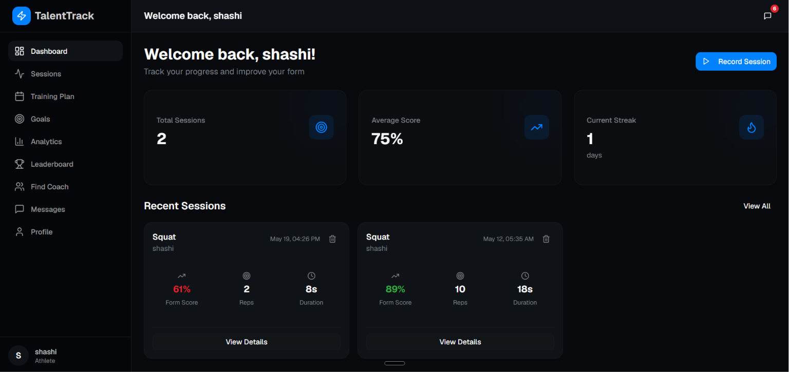
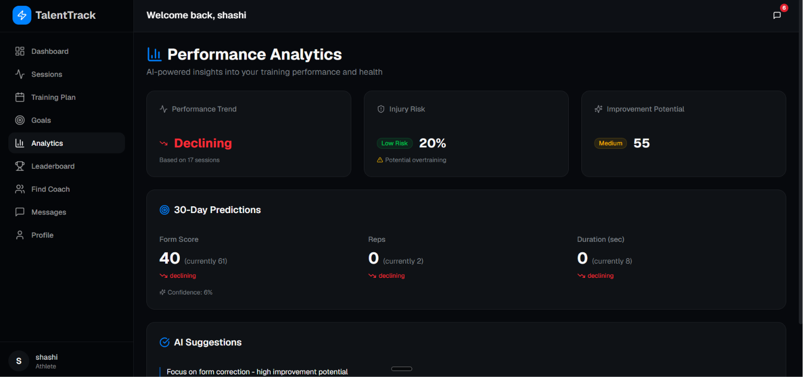
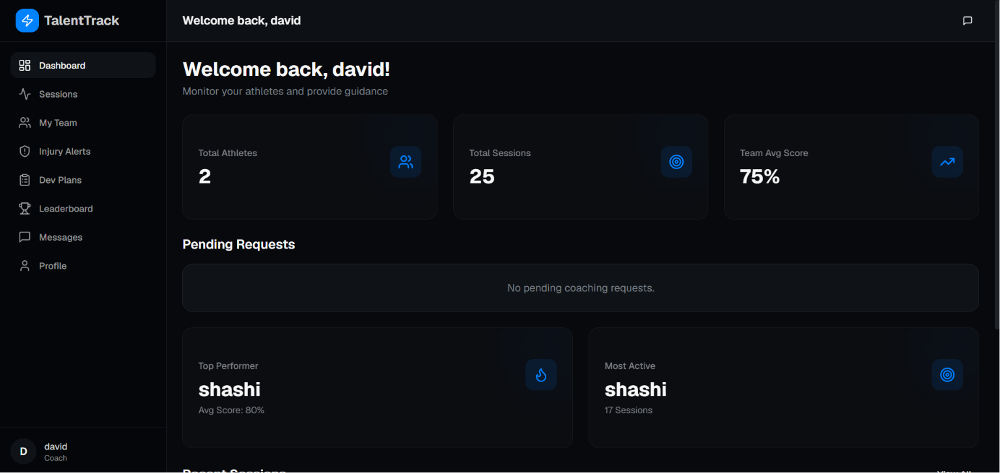
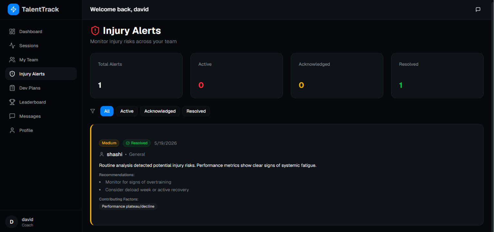
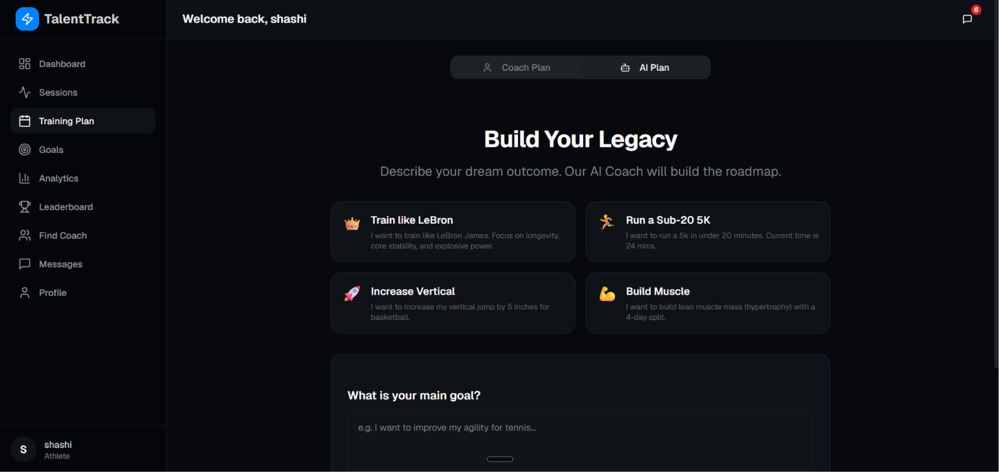
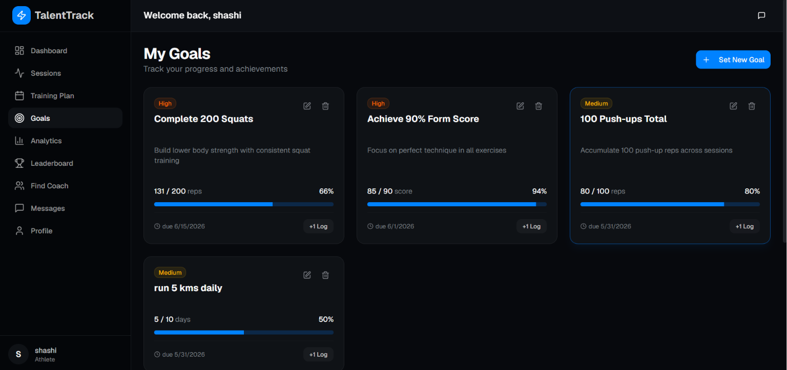
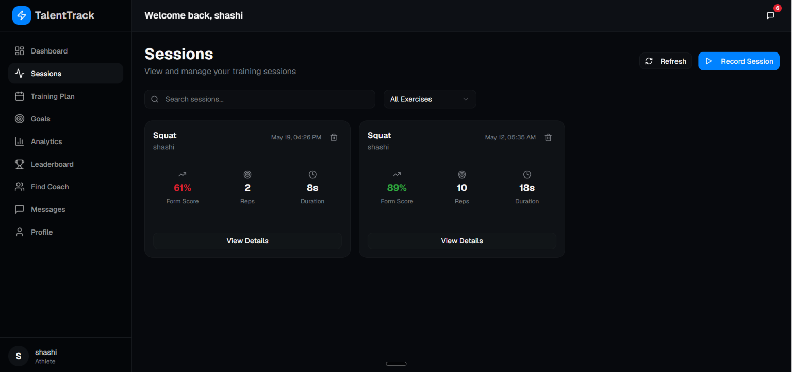

# 🏃‍♂️ TalentTrack - AI-Powered Sports Talent Ecosystem

[](#)
[](#)
[](https://opensource.org/licenses/MIT)

> **Revolutionizing Sports Training with AI-Powered Video Analysis and Smart Ecosystem**

TalentTrack is an end-to-end digital ecosystem that bridges the gap between aspiring athletes and professional coaching. By leveraging cutting-edge AI and computer vision, it democratizes access to elite training methods, injury prevention, and performance analytics. 

Whether you're an athlete looking to perfect your form or a coach managing a team of rising stars, TalentTrack provides the tools needed to succeed.

---

## 🌟 The Ecosystem

TalentTrack offers two distinct, fully integrated experiences tailored for Athletes and Coaches.

### 🏋️‍♂️ Athlete Experience

The athlete portal is designed to provide actionable feedback, structured training, and a clear path to improvement.

- **AI-Powered Form Analysis**: Upload training videos and get instant feedback on posture, form, and technique using MediaPipe.
- **Smart Training Plans**: Generate personalized, AI-driven workout schedules tailored to your goals.
- **Performance Analytics**: Track reps, set goals, and visualize progress over time.
- **Community & Leaderboards**: See how you stack up against peers and stay motivated.

<p align="center">
  
  
</p>
<p align="center">
  <em>Athlete Dashboard & Performance Analytics</em>
</p>

### 👨‍🏫 Coach Experience

The coach portal provides a command center for managing teams, tracking athlete development, and preventing injuries.

- **Team Roster & Overview**: Monitor the performance and compliance of all assigned athletes in one place.
- **Injury Risk Alerts**: Proactive notifications when an athlete's data indicates a high risk of overtraining or injury.
- **Long-term Development Plans**: Build and assign structured roadmaps (e.g., "Road to Regionals") for athletes.
- **Direct Messaging**: Provide qualitative feedback directly alongside quantitative data.

<p align="center">
  
  
</p>
<p align="center">
  <em>Coach Dashboard & Predictive Injury Alerts</em>
</p>

---

## 🚀 Key Features Deep-Dive

### AI Training Plan Generation
Athletes can request training plans tailored to their specific goals. The system uses Google Gemini to instantly generate structured, day-by-day routines that are automatically added to the athlete's schedule.

<p align="center">
  
</p>

### Real-time AI Form Scoring
By simply recording an exercise on a smartphone, the system uses computer vision to detect biomechanical markers, calculate joint angles, count reps, and score the movement to prevent bad habits.

### Advanced Goal & Session Management
Track granular details for every workout session and set both short-term and long-term milestones.

<p align="center">
  
  
</p>

---

## 🛠️ Tech Stack

This project was built with modern, high-performance technologies to ensure scalability and a smooth user experience.

- **Frontend**: Next.js 14 (App Router), TypeScript, Tailwind CSS, shadcn/ui, Recharts
- **Backend**: FastAPI (Python), Uvicorn
- **AI & Computer Vision**: MediaPipe (Pose Detection), OpenCV, Google Gemini API
- **Data Storage**: JSON-based localized storage (designed for easy migration to PostgreSQL/MongoDB)

---

## 🏁 Quick Start Guide

### Prerequisites
- Node.js 18+ and npm
- Python 3.8+

### 1. Clone & Setup
```bash
git clone https://github.com/udaykumar0515/TalentTrack---AI-Powered-Sports-Talent-Ecosystem-.git
cd sports_talent_ecosystem
```

### 2. Run Backend
```bash
cd backend
python -m venv venv
# Windows: venv\Scripts\activate | Mac/Linux: source venv/bin/activate
pip install -r requirements.txt
python main.py
```
*API will run at `http://localhost:8000`*

### 3. Run Frontend
```bash
cd frontend
npm install
npm run dev
```
*App will run at `http://localhost:5173`*

---

## 🔐 Demo Accounts

Experience the platform from both perspectives:

**Athletes (Password: `123456`)**
- `uday@example.com`
- `bhanu@example.com`

**Coaches (Password: `000000`)**
- `coach_david@example.com`
- `coach_mike@example.com`

---

## 📄 License & Acknowledgements
- Licensed under the MIT License.
